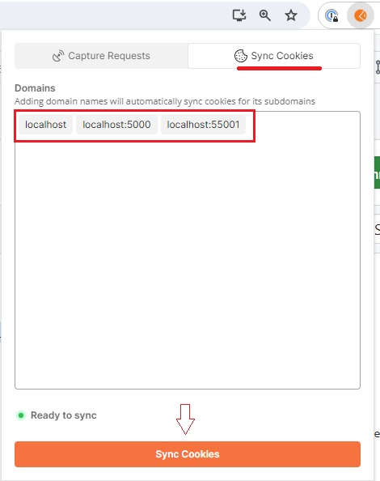

# Internal-Api Local Env

Postman collection tailored for internal-api in local environment

# Reports

## Entries

Find all the information about entries endpoints [here](https://github.com/e-conomic/e-conomic/blob/master/code/Economic.InternalApi/Endpoints/Reports/Statements/Entries/EntriesReportController.Net.cs)

### POST `/internal-api/reports/statements/entries`

**Body payload**   [more](https://github.com/e-conomic/e-conomic/blob/master/code/Economic.Dto/Reports/Statements/Entries/ReportyEntriesDto.cs)

```
{
    "orderBy": "accountNumber",
    "orderByDescending": true,
    "from": "2014-01-01",
    "to": "2014-01-02",
    "fromAccount": 2000,
    "toAccount": 3000
    ...
}
```

## Chart of accounts

Find all the information about chart of accounts endpoints [here](https://github.com/e-conomic/e-conomic/blob/master/code/Economic.InternalApi/Endpoints/Reports/Statements/ChartOfAccounts/ChartOfAccountsController.Net.cs) 

### GET `/internal-api/reports/statements/accounts`

**Query String Parameters** [here](https://github.com/e-conomic/e-conomic/blob/master/code/Economic.Accounting.Dto/AccountDto.cs)


## Ledger cards

Find all the information about chart of accounts endpoints [here](https://github.com/e-conomic/e-conomic/blob/master/code/Economic.InternalApi/Endpoints/Reports/Statements/LedgerCardsController.Net.cs)

### POST `/internal-api/reports/statements/ledger-cards/`

**Body payload** [more](https://github.com/e-conomic/e-conomic/blob/master/code/Economic.InternalApi.Model/Reports/Statements/LedgerCards/GetLedgerCardsreportLinesModel.cs)

```
{
    "fromDate": "2022-01-01T12:00:00.000Z",
    "toDate": "2022-12-31T12:00:00.000Z",
    "fromAccount": 999,
    "toAccount": 1310,
    "newPageAfterEachAccount": true,
    "includeDayBookEntries": true,
    "showUnits": true,
    "currency": "",
    "view": 0
}
```

## Period total

## Turnover Statistics


## How to get token updated in local postman

- Add to your browser the postman interceptor [extension](https://chromewebstore.google.com/detail/postman-interceptor/aicmkgpgakddgnaphhhpliifpcfhicfo)

- Configure accordingly to the image below
  - 
- Every time you start you api make the request **Get Econ Token** and automatically the token will be set to the local requests
